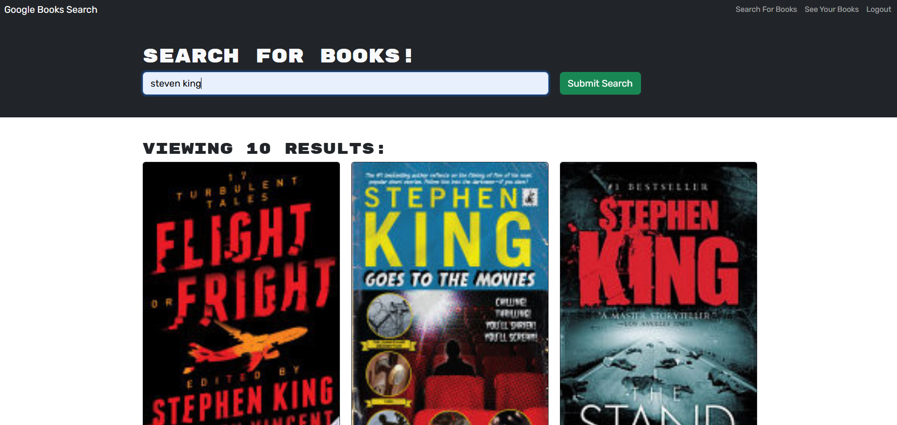

# Google Books API Search Engine

## Description

This project leverages Express, MongoDB, Mongoose, React, and Apollo Client. With the Google Books API Search Engine, I successfully developed a full-stack application that integrates a document-based database using MongoDB. I utilized Mongoose to create schemas and manage data, enhancing my understanding of database interactions. The frontend is built with React and Apollo Client to handle GraphQL queries and mutations efficiently, providing a seamless user experience for searching and saving books from the Google Books API.

## Table of Contents

- [Installation](#installation)
- [Usage](#usage)
    - [Searching](#searching)
    - [Login & Sign Up](#login--sign-up)
- [License](#license)
- [Questions](#questions)

## Installation

To install the necessary dependencies, first navigate into the Develop folder by running `cd Develop/`. Then, execute the command `npm i`. This will concurrently install all required dependencies from all three package.json files.

## Usage

To begin, start the app with `npm run dev`. This will start both the server and the front end using Vite. At this point, a user can search for books or log in/sign up. 

### Searching

Users can search using a query, which can be the author, title of the book, etc. This searches the Google Books API for matches and neatly displays them for review. The image of the book is also a link that takes the user to the Google Books page to learn more about the book.

### Login & Sign Up

If the user signs up for the site, they will see a button under each searched book that allows them to save the book. Additionally, they can view their saved books in the navigation bar above. In the saved books section, a user can review all books they have saved or remove any book with a simple click. The image of the book is a link that takes the user to the Google Books page to learn more.

## License

Licensed under the MIT license.

[MIT License](https://opensource.org/licenses/MIT)

## Questions

For any questions, please contact WestleyCervantes@gmail.com. Visit [wacwestley30](https://github.com/wacwestley30) for more projects.
